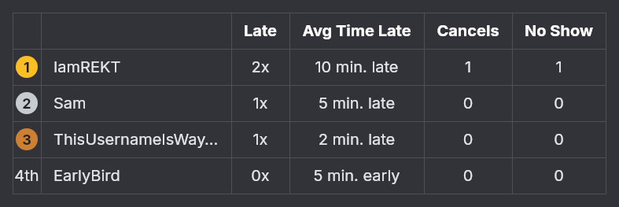

# Voice Chat Punctuality Bot

A Discord bot for your server that:

1. Reads normal chat messages and notices when someone says they're about to join voice chat — "omw, joining in 10 min", "be there at 9", "hopping on at 9:30pm", "be on in 10".
2. Watches for that person actually joining a voice channel.
3. Replies in the channel saying whether they were early, on time, or late — or, if they never show up at all, notes that they no-showed.
4. Keeps score, so `/leaderboard` shows everyone ranked from latest to least late (and who ghosts) — standings reset each calendar month, with all-time still one option away. Set up `/leaderboard-here` for a live scoreboard message that updates itself in a channel of your choice.
5. Lets other people opt into someone else’s stated plan just by tapping the ⏰ reaction on it, so a whole group can be held to one stated time.

No slash command is needed to make a plan — you just talk normally and the bot listens for it. This guide assumes you've never coded before and walks through every step. It'll take roughly 30–45 minutes the first time.

---

## Contents

- [Part 1 — Create the bot on Discord](#part-1--create-the-bot-on-discord)
- [Part 2 — Invite the bot to your server](#part-2--invite-the-bot-to-your-server)
- [Part 3 — Run it on your own computer](#part-3--run-it-on-your-own-computer)
- [Part 4 — Keep it running 24/7](#part-4--keep-it-running-247)
- [How to talk to the bot](#how-to-talk-to-the-bot)
- [Reading the leaderboard](#reading-the-leaderboard)
- [Live leaderboard channel](#live-leaderboard-channel)
- [Voice-join log channel](#voice-join-log-channel)
- [Monthly awards](#monthly-awards)
- [Customizing](#customizing)
- [Known limitations](#known-limitations)
- [Troubleshooting](#troubleshooting)

---

## Part 1 — Create the bot on Discord

1. Go to the [Discord Developer Portal](https://discord.com/developers/applications) and log in with your normal Discord account.
2. Click **New Application** (sometimes labeled "Create App"), give it a name like "Punctuality Bot", and create it.
3. In the left sidebar, click **Bot**.
4. Click **Reset Token**, then **Copy**. This long string is your bot's password — treat it like one. You'll paste it into the project in Part 3.
   - If you ever think it's leaked, come back here and click Reset Token again to invalidate the old one.
5. Still on the **Bot** page, scroll down to the section for privileged intents (it may be labeled **Privileged Gateway Intents**). Turn ON **Message Content Intent**. This is required — without it, the bot receives blank messages and can never detect your plans.
   - **Server Members Intent** and **Presence Intent** are not needed for this bot; you can leave those off.

## Part 2 — Invite the bot to your server

1. In the left sidebar, click **Installation**.
2. Under **Installation Contexts**, make sure **Guild Install** is enabled.
3. Under **Default Install Settings**, for the Guild Install scopes, add both `bot` and `applications.commands`.
4. Selecting `bot` reveals a permissions list. Check:
   - View Channels
   - Send Messages
   - Read Message History
   - Add Reactions
   - Embed Links
   - Attach Files (needed so the leaderboard's table image can be posted)
5. Copy the **Install Link** shown on that page, paste it into your browser, choose **Add to Server**, pick your server, and confirm.

The bot will appear offline in your member list for now — that's expected, it comes online once you actually run the code (next part).

## Part 3 — Run it on your own computer

This step lets you make sure everything works before putting it online 24/7.

### Install Node.js (skip if you already have it)

1. Go to [nodejs.org](https://nodejs.org) and download the **LTS** version for your operating system.
2. Run the installer, accepting the defaults.
3. Open a terminal (**Terminal** on Mac, **Command Prompt** or **PowerShell** on Windows) and type:
   ```
   node -v
   ```
   You should see a version number like `v20.x.x` or higher. If you see "command not found", restart your computer and try again.

### Set up the project

1. Unzip the project folder you were given somewhere easy to find, e.g. your Desktop.
2. Open a terminal and navigate into the folder. For example, if it's on your Desktop and named `discord-vc-bot`:
   ```
   cd Desktop/discord-vc-bot
   ```
3. Install the project's dependencies:
   ```
   npm install
   ```
   This downloads the libraries the bot uses (discord.js, chrono-node, dotenv, and `@napi-rs/canvas` for drawing the leaderboard image). It's normal for this to take a minute.
4. Create your own copy of the settings file:
   - Find the file named `.env.example` in the folder, duplicate it, and rename the copy to `.env` (just `.env`, nothing before the dot).
   - Open `.env` in any text editor and paste your bot token (from Part 1, step 4) after `DISCORD_TOKEN=`, with no quotes and no spaces:
     ```
     DISCORD_TOKEN=your-long-token-here
     ```
   - Everything else in `.env` has a sensible default — see [Customizing](#customizing) if you want to change your timezone, etc.

### Run it

```
npm start
```

You should see something like:
```
Logged in as Punctuality Bot#1234
Slash commands registered in 1 server(s).
```

In Discord, the bot should now show as online. Try it:
- Type `omw, joining in 2 min` in a text channel the bot can see. It should react with a ⏰.
- Join any voice channel within those 2 minutes. The bot should post a message saying whether you were early, on time, or late.
- Type another plan, then reply `nvm` before joining. It should react with 🚫 instead, and stay quiet after.
- Run `/leaderboard`, `/leaderboard-here`, `/track`, `/cancel`, `/uncancel`, `/log-here`, `/awards`, `/awards-here`, and `/help` to see the slash commands.

(No-shows take up to `PLAN_EXPIRY_HOURS` — 12 hours by default — to trigger, so you won't see one during a quick local test unless you leave the bot running that long. That's expected; see [Customizing](#customizing) if you'd rather use a shorter window.)

To stop the bot, go back to the terminal and press `Ctrl+C`.

---

## Part 4 — Keep it running 24/7

Running it on your own computer only works while that computer is on and the terminal window is open. To have it running all the time, you need to put it on a server somewhere else — "hosting."

**This bot is hosted on an Oracle Cloud "Always Free" compute instance.** That tier is genuinely free with no time limit, gives you a real Linux machine with a real disk, and — unlike the free tiers of most app hosts — never sleeps and never wipes your data on redeploy. The trade-off is that you set it up once as an actual server rather than clicking through a dashboard.

### First-time setup (already done — here for reference)

1. **Create the instance:** at [cloud.oracle.com](https://cloud.oracle.com), create a free-tier **Compute instance** running **Ubuntu**. When it offers you an SSH key, download it and keep it safe — it's the only way in. Note the instance's **public IP address**.
2. **Connect to it** from PowerShell or Terminal:
   ```
   ssh -i ~/.ssh/your-key-file.key ubuntu@YOUR-SERVER-IP
   ```
3. **Install Node.js and git** on the server:
   ```
   sudo apt update && sudo apt install -y nodejs npm git
   ```
4. **Clone the code and install dependencies:**
   ```
   git clone https://github.com/YOUR-USERNAME/discord-vc-bot.git
   cd discord-vc-bot
   npm install
   ```
5. **Create the `.env` file** on the server with your token (`nano .env`, paste, then `Ctrl+O`, `Enter`, `Ctrl+X`). This file lives only on the server and is never committed — see [Customizing](#customizing) for what can go in it.
6. **Run it as a service** so it starts on boot and restarts if it crashes. Create `/etc/systemd/system/bot.service` with `sudo nano /etc/systemd/system/bot.service`, then enable it:
   ```
   sudo systemctl enable bot
   sudo systemctl start bot
   ```

### Everyday use

**To update the bot after changing the code:**

```
ssh -i ~/.ssh/your-key-file.key ubuntu@YOUR-SERVER-IP
cd discord-vc-bot
git pull origin main
sudo systemctl restart bot
```

**To check it's running / see errors:**

```
sudo journalctl -f -u bot
```

Press `Ctrl+C` to stop watching the log. A healthy start looks like `Logged in as...` followed by `Slash commands registered in N server(s).`

**Because the server has a real disk, your data persists.** `results.json` and the channel settings for `/leaderboard-here`, `/log-here` and `/awards-here` all survive restarts and redeploys — you set those up once and they stay set.

> **Note on the built-in web server:** `src/index.js` starts a tiny HTTP server, but only if a `PORT` environment variable is set. That exists for app hosts whose free tiers sleep without web traffic. On this setup nothing sets `PORT`, so it never starts — you don't need an uptime pinger.

---

## How to talk to the bot

No command needed — just chat naturally. The bot looks for a "join intent" phrase (like "omw", "joining", "hopping on", "be there", "be on", "getting on", "game in/at", "on in/at", or mentioning "vc") combined with a time:

- "omw, joining in 10 min"
- "be there at 9"
- "hopping on at 9:30pm"
- "vc in 5"
- "getting on in 10"
- "game at 9"
- "on in 5"
- "on my way, 15 minutes"
- "be on in 10" (bare numbers after "in" are assumed to mean minutes)

There are two exceptions to the "needs a join-intent phrase" rule, both for messages that are *nothing but* a time:

- **Just a clock time** — "10:30", "9pm", "7:15 am" — is tracked as that time. A colon or an am/pm can only mean a clock time, so there's nothing to be unsure about.
- **Just a number** — "30" — means "in 30 minutes", the common shorthand when someone's already asked "when?". It only kicks in when the whole message is the number (trailing punctuation like "30?" is fine); a number inside a longer sentence still needs a real intent phrase. Numbers below 1 or above 180 are ignored as implausible.

**If a bare number is genuinely ambiguous, the bot asks instead of guessing.** "10" could mean "in 10 minutes" or "at 10 o'clock", and there's no way to tell from the message. So for any bare number that's also a valid clock hour (1–12), the bot reacts with **⏳** (minutes) and **🕐** (o'clock) and tracks nothing until you tap one. Numbers above 12 aren't ambiguous — nobody means "at 45 o'clock" — so those are still read straight as minutes with no prompt.

**Anyone can join someone else's plan.** Every tracked plan gets a ⏰ from the bot; tapping that same ⏰ signs you up for the same stated time, with your own verdict and your own no-show note. Tap it again to drop out — backing out of someone else's plan isn't flaking on your own, so it costs you nothing on the leaderboard. Use **`/track`** to start a plan for this on purpose (e.g. `/track when: 9pm`), which posts a public message for people to react to.

If it understood you, it reacts with ⏰ on your message. When you join a voice channel afterward, it replies in that same text channel with the verdict. Run `/help` any time for a quick in-Discord reminder, and `/leaderboard` to see the server rankings.

**Show up 30+ minutes late and the bot gets a little petty about it.** Instead of the plain "late by N min" message, it posts a random passive-aggressive line — something like "Nice of you to join us in this century." — with the exact lateness and times still included afterward in parentheses, so nothing's actually lost. Change how late counts as "too late" with `ROAST_THRESHOLD_MINUTES` (default 30), or open `src/roastLines.js` and add/edit lines yourself — it's just a plain list of strings, no code experience needed (include the text `{minutes}` in a line and it'll be replaced with the actual number of minutes late). **This is the one message `/log-here` (below) doesn't redirect** — even on a server with a silent log channel set up, a roast always posts, and pings, right back in the channel it was announced in, since a roast that nobody sees kind of misses the point. Everything else (on time, early, and late-but-under-the-threshold) still goes to the log channel silently as normal.

**Changed your mind, or did the bot get it wrong?** Reply with "nevermind" or "nvm" and the bot cancels your plan quietly (reacting with 🚫) — it won't post a no-show note for it later. This is also logged and shows up in the **Cancels** column on `/leaderboard`, since actually backing out of a stated plan is its own kind of punctuality stat. If you instead send a new time ("nvm, joining at 10 instead"), that's treated as an update, not a cancellation — the new time replaces the old one automatically and nothing gets logged.

You can also run **`/cancel`** to erase a pending plan — same immediate effect (no no-show note later), but it deliberately does **not** add to the Cancels column. It's meant for correcting a bot mistake (for example, a bare number typed for an unrelated reason got misread as a join plan - see the bare-number shorthand above), not for tallying real flaking, so fixing an error this way doesn't count against you the way an actual "nevermind" does.

**Said "nvm" to a friend and the bot took it personally?** Run **`/uncancel`**. The bot can't tell "nvm, not joining after all" from "nvm, found it" — both are just the word "nvm" typed while you happen to have a plan pending — so it will sometimes cancel a plan you never meant to call off. `/uncancel` puts the plan back *and* removes the cancellation from the leaderboard, leaving things exactly as they were. It only works on your most recent cancellation, and only while that plan would still be live.

**Turning up absurdly early gets called out too.** Arrive `EARLY_SCOLD_THRESHOLD_MINUTES` (default 60) or more before the time you gave, and instead of a plain "early by N min" you'll get a line from a separate pool about not keeping to your own stated time — because everyone else worked off a time that turned out to be fiction. Mildly early is still just fine and reported plainly. Like a roast, an early scold always posts in the original channel even when `/log-here` is set.

**No-shows.** If you say you're joining but never actually do, the bot waits `PLAN_EXPIRY_HOURS` (default 12) hours past your stated time, then posts a note that you no-showed and stops tracking that plan. Cancel with "nevermind"/"nvm" or `/cancel` beforehand to avoid that note entirely. No-shows are also logged and shown in the **No Show** column on `/leaderboard`, but don't affect where you're ranked.

---

## Reading the leaderboard

`/leaderboard` and the live message from `/leaderboard-here` both render the same table, ranked latest to least late — as an actual image, not typed-out text, so it looks the same whether it's opened on a phone or a desktop:



(That example has more rows than a real one-person leaderboard would, just to show off medals, a 4th-place ordinal, and name truncation at once.)

- **Placement / User** (unlabeled columns) — rank, then display name. 1st, 2nd, and 3rd get a medal instead of an ordinal; 4th place and beyond show as "4th", "5th", etc. Long names get truncated to keep the table readable.
- **Late** — how many of their tracked joins were actually late (not early, not on time), shown as e.g. "5x".
- **Avg Time Late** — average lateness across every tracked join. This is what placement is sorted by, so it can also read "on time" or end in "early" if their average isn't positive.
- **Cancels** — times they said "nevermind"/"nvm" on a plan they'd already stated. (`/cancel` doesn't add here — see above.)
- **No Show** — times they said they'd join and then never did.

**The standings cover the current calendar month.** Every 1st, the table starts fresh, so one bad week doesn't follow someone around all year. Nothing is deleted — run `/leaderboard scope: All time` for the full history, and see [Live leaderboard channel](#live-leaderboard-channel) for how the self-updating message keeps each finished month as its own post.

This table image is drawn for Discord's **dark theme** — see [Known limitations](#known-limitations) if you or your server uses light mode.

## Live leaderboard channel

`/leaderboard` posts a one-off snapshot wherever you run it. If you'd rather have one message that keeps itself updated automatically — a permanent scoreboard in, say, a `#leaderboard` channel — go to that channel and run `/leaderboard-here`. The bot posts the leaderboard there and edits that same message in place every time someone joins voice or no-shows, instead of posting a new message each time.

A few things worth knowing:
- Only server members with the **Manage Server** permission can run `/leaderboard-here` (regular members won't see it in their command list) — that's intentional, so the channel can't be redirected by just anyone. If you want to allow other people, go to your server's **Settings → Integrations → [your bot's name]** and adjust who can use that specific command.
- Running `/leaderboard-here` again in a *different* channel moves it there — the old post stops updating (it's left behind as a stale snapshot; delete it manually if you don't want it hanging around).
- Running it again in the *same* channel just refreshes it immediately, no duplicate message.
- If someone deletes the live message by hand, the bot notices next time it needs to update and posts a fresh one automatically.
- **It starts a new message each month.** When the calendar month turns over, the bot edits the current message one last time so it shows that month’s final standings (dropping the "Live" footer), leaves it in the channel as a permanent record, and posts a fresh live message below it for the new month. Nothing is deleted — not the old message, and not the underlying history.

## Voice-join log channel

By default, when someone joins voice the "early/on time/late" message posts back in whichever channel they announced their plan in, and pings them. If you'd rather those messages went to one dedicated channel instead — say, a `#voice-log` only some people check — go to that channel and run **`/log-here`**.

A few things worth knowing:
- Once set up, **every** voice-join message (early, on-time, and late) goes to that channel instead of the original one, and **doesn't ping** the person — it still shows who joined as a mention you can click, it just won't send them a notification.
- **One deliberate exception: passive-aggressive roasts.** A join that's late enough to trigger a roast line (see "How to talk to the bot" above, `ROAST_THRESHOLD_MINUTES`) always stays in the original announcement channel and pings normally, even with `/log-here` set up — the whole point of a roast is being seen live, so it's never the thing that gets quietly filed away. Every other verdict (on time, early, or late but under the roast threshold) still redirects and goes silent exactly as described above.
- Only server members with the **Manage Server** permission can run `/log-here` (same reasoning as `/leaderboard-here` — it redirects output for the whole server).
- This only affects voice-join verdict messages. `/leaderboard`, `/leaderboard-here`, and no-show notes are unaffected and unchanged.
- Running `/log-here` again in a different channel moves it there. There's currently no command to turn it off entirely and go back to posting in the original announcement channels — ask if you want that added.

## Monthly awards

Alongside the leaderboard, the bot can also post a "hall of fame" (or shame) for whichever month just ended — three awards, each its own winner:

- ⏰ **Most Late** — whoever was late the most *times* that month.
- ⏱️ **Most Time Late** — whoever racked up the most total minutes late that month, added up across every late join. This can crown someone different from "Most Late" — one very late join can outweigh several slightly-late ones.
- 🚫 **Most Cancels** — whoever said "nevermind"/"nvm" the most that month (same nvm-only rule as the leaderboard's Cancels column — `/cancel` doesn't count here either).

A category with nobody in it (nobody was late all month, say) reads as a small celebration instead of showing a "0".

**Want to see it on demand?** Run **`/awards`** any time to post the most recently completed month's awards right now — open to everyone, nothing to set up first, and it works even if you never run `/awards-here` below. Running it doesn't affect the automatic post in any way (it doesn't touch which channel is configured or when the next automatic post is due), so it's safe to run as often as you like, e.g. to double-check what's going to be announced before the month actually turns over.

**Want it posted automatically, every month, without having to remember?** Go to whichever channel you want the announcement in and run **`/awards-here`**. A few things worth knowing:
- It posts automatically at the start of each new month, awarding the month that just ended — nothing to run yourself once it's set up.
- Setting it up posts an immediate preview of the most recently completed month, so you can see what it looks like right away instead of waiting.
- Only server members with the **Manage Server** permission can run `/awards-here` (same reasoning as `/leaderboard-here` and `/log-here`) — unlike `/awards` above, which anyone can run.
- Running `/awards-here` again in a different channel moves it there.
- The bot checks for a new month roughly once an hour, so the automatic post can land up to ~an hour into the new month rather than at the exact stroke of midnight.

## Customizing

All settings live in your `.env` file:

| Variable | Default | What it does |
|---|---|---|
| `DISCORD_TOKEN` | *(required)* | Your bot's login token from Part 1. |
| `BOT_TIMEZONE` | `America/Los_Angeles` | Timezone used to understand "at 9pm", to display times, and to decide where one calendar month ends and the next begins for monthly awards. [Full list of valid names](https://en.wikipedia.org/wiki/List_of_tz_database_time_zones). |
| `GRACE_PERIOD_MINUTES` | `2` | +/- this many minutes still counts as "on time". |
| `PLAN_EXPIRY_HOURS` | `12` | Hours after the *stated* join time before a never-followed-through-on plan is marked a no-show. |
| `ROAST_THRESHOLD_MINUTES` | `30` | Minutes late (or more) before the join reply swaps in a random passive-aggressive line (`src/roastLines.js`) instead of the plain "late by N min" text. |
| `EARLY_SCOLD_THRESHOLD_MINUTES` | `60` | The mirror image: minutes EARLY (or more) before the reply calls you out for not keeping to the time you gave. Uses a separate line pool in `src/roastLines.js`. |
| `MAX_FUTURE_HOURS` | `12` | How far ahead a stated time can be before the bot decides it is not a "joining soon" plan and ignores it. Raise this if your group announces plans further out. |
| `ALLOWED_CHANNEL_IDS` | *(blank = all channels)* | Comma-separated channel IDs to restrict message-scanning to specific channels. |
| `DB_PATH` | `data/results.json` | Where leaderboard history is stored. Nothing is ever deleted here, including at a monthly reset. |
| `LIVE_LEADERBOARD_PATH` | `data/live-leaderboard.json` | Where the bot remembers the `/leaderboard-here` channel+message. Same deal as `DB_PATH`. |
| `LOG_CHANNEL_PATH` | `data/log-channel.json` | Where the bot remembers the `/log-here` channel. Same deal as `DB_PATH`. |
| `AWARDS_CHANNEL_PATH` | `data/awards-channel.json` | Where the bot remembers the `/awards-here` channel and which month it last posted. Same deal as `DB_PATH`. |

After changing `.env`, restart the bot (`Ctrl+C` then `npm start` again locally, or redeploy on your host) for changes to take effect.

## Known limitations

Worth knowing about, in case behavior ever looks surprising:

- **Restarting loses in-progress plans.** A stated plan ("joining at 9") lives in memory until that person joins voice, cancels, or no-shows. If the bot restarts in between, that one plan (and its eventual no-show note, if it would have gotten one) is lost — the leaderboard history itself is safe in the data file, this only affects a plan caught mid-flight.
- **One timezone for the whole server.** `BOT_TIMEZONE` applies to everyone. Fine for a friend group in the same region; not designed for a server spread across timezones.
- **Any voice channel counts.** The bot doesn't try to figure out *which* voice channel someone named — joining any voice channel in the server resolves their plan.
- **Natural language parsing isn't perfect.** It's tuned to avoid false positives (it won't fire on a random message that happens to contain a number), which means occasionally it'll miss an unusually-phrased plan. If you notice a common phrase it's not catching, that's an easy tweak to `src/timeParser.js`.
- **Explicit weekday mentions are ignored on purpose** ("next Friday at 9pm") — this bot is meant for "joining very soon," not scheduling ahead.
- **No-show checks happen every 5 minutes**, not the instant the window elapses — so a no-show note can land up to ~5 minutes after the `PLAN_EXPIRY_HOURS` cutoff.
- **The automatic monthly posts need the bot to be running when the month turns over.** Both the `/awards-here` post and the new monthly leaderboard fire from a check that runs once an hour while the bot is up. If the bot happens to be stopped across the entire month boundary, that month's automatic post is skipped — `/awards` still shows it on demand, and the leaderboard rolls over on the next restart.
- **Un-reacting to a shared plan only works while the bot has been running since the plan was posted.** Who joined which plan is kept in memory, like the plans themselves. After a restart, tapping ⏰ on an older message won't do anything, because the bot no longer remembers that message was a plan.
- **The leaderboard table image is drawn for dark mode.** It's a picture, not text, so it always looks pixel-identical everywhere (which is the whole reason it's an image) — but there's no way for the bot to know whether a given person is using Discord's light or dark theme, and it was designed to match dark mode. A light-theme viewer will see the table's light-colored text sitting on their light background, which reads worse than it does in dark mode.
- **Roast lines are one-size-fits-all.** Everyone who's late past `ROAST_THRESHOLD_MINUTES` gets a random line from the same shared list in `src/roastLines.js` — there's no per-person opt-out short of raising that threshold sky-high, and the tone (dry/sarcastic) isn't configurable beyond editing the lines yourself. The same goes for the early-arrival lines and `EARLY_SCOLD_THRESHOLD_MINUTES`. Make sure your server's actually up for the ribbing before turning either threshold down.
- **"on in"/"on at" is a deliberately loose trigger.** Adding it means "on in 10" and "on at 9" get tracked, which is how people here actually talk — but it also means an unrelated sentence like "the movie was on at 10" will start a plan. That was a conscious trade-off in favour of catching real plans; `/cancel` clears any false positive, and it won't count against you.
- **There's still no command to turn `/log-here` back off** once a server has set it — only to move it to a different channel.

## Troubleshooting

**Bot shows offline in Discord.**
Check the terminal (or your host's logs) for an error. Most common cause: `DISCORD_TOKEN` in `.env` is missing or wrong — go back to the Bot page in the Developer Portal and Reset Token to get a fresh one.

**Bot is online but never reacts to my messages.**
Almost always the **Message Content Intent** toggle (Part 1, step 5) is off. Turn it on, then restart the bot.

**Bot reacts with ⏰ but never replies when I join voice.**
Make sure the bot has permission to see the voice channel you joined (View Channels), and that you joined within the no-show window (`PLAN_EXPIRY_HOURS`, default 12 hours) — otherwise it already posted a no-show note and stopped tracking that plan.

**`/leaderboard` or `/help` don't show up when I type `/`.**
Slash commands register automatically each time the bot starts, per server — restart the bot once after inviting it, and make sure you invited it with the `applications.commands` scope (Part 2, step 3).

**`/leaderboard-here`, `/log-here`, or `/awards-here` don't show up when I type `/`, but the other commands do.**
All three are restricted to members with the **Manage Server** permission by design (see [Live leaderboard channel](#live-leaderboard-channel) / [Voice-join log channel](#voice-join-log-channel) / [Monthly awards](#monthly-awards)) — if that's not you, ask someone who has it, or have them adjust it in **Settings → Integrations**.

**`npm install` fails.**
Usually a Node.js version issue — confirm `node -v` shows v18 or higher. If you see a permissions error on macOS/Linux, avoid using `sudo`; instead search "fix npm permissions" for your OS, or reinstall Node.js via [nvm](https://github.com/nvm-sh/nvm).

**The leaderboard looks empty at the start of a month.**
That is the monthly reset working as intended — standings now cover the current calendar month. Nothing was deleted: run `/leaderboard scope: All time` to see the full history, and last month’s final table is still sitting in the channel as its own message.

**Leaderboard data actually disappeared.**
On the Oracle server the data file lives on a real disk and survives restarts and `git pull`, so this should not happen. Check that you are looking at the right scope (see above) first. If the data is genuinely gone, check `ls -la ~/discord-vc-bot/data/` on the server and `sudo journalctl -u bot | grep -i "could not read"` for a corrupted-file warning.

**`/leaderboard` or `/leaderboard-here` reply with an error, or the message shows up with a broken-image icon where the table should be.**
The bot is very likely missing the **Attach Files** permission — the leaderboard table is posted as an image, which needs that permission separately from Embed Links (a bot invited before this feature was added won't have it yet). Fix: **Server Settings → Roles →** find the bot's role → turn on **Attach Files** → **Save Changes**. No need to re-invite the bot or touch code.

**The bot won’t start after an update on the server.**
Watch the log while it tries: `sudo journalctl -f -u bot`. The usual causes, in order of likelihood:
- **A new dependency was added.** Run `npm install` again after `git pull` — a restart alone won’t fetch it.
- **`Cannot find module`.** Confirm you are in the right folder and that `ls` shows `src/`, `package.json` and `node_modules/` side by side.
- **`Failed to log in to Discord`.** The `.env` file on the server is missing or has a stale token. It is deliberately not in git, so it never arrives via `git pull` — check it with `cat .env` on the server.

**Tapping ⏰ on a plan does nothing.**
Either the plan was posted before the bot last restarted (it only remembers plans in memory, so a restart forgets which messages were plans), or the bot is missing the **Add Reactions** / **Read Message History** permission in that channel.
